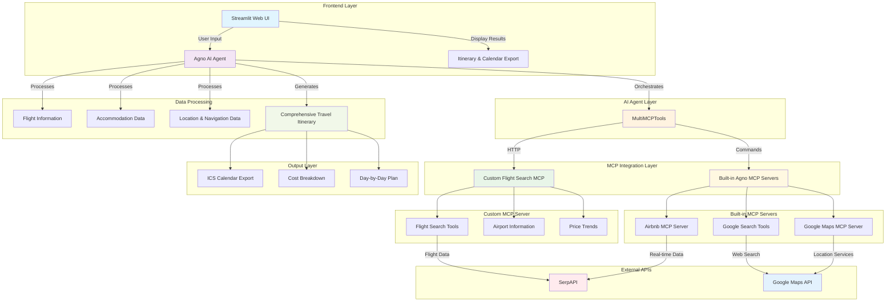

# Gen AI Travel Agent (Multi-MCP Servers Integration, RAG, Agno, OpenAI, Google SerpAPI, Multiple Agents)

A holistic AI-powered travel planning application that integrates multiple Model Context Protocol (MCP) servers to create detailed, real-time travel itineraries. Combines flight search, accommodation booking, location services, and comprehensive travel planning in one seamless interface.


### Demo Video
<video width="600" controls>
  <source src="https://github.com/alivnavc/Gen-AI-Travel-Agent/raw/master/MCP_GenAI_Travel_Planner.mp4" type="video/mp4">
  Your browser does not support the video tag.
</video>

## Features

- **Real-time Flight Search**: Live flight data with prices, airlines, and booking links
- **Airbnb Integration**: Real accommodation listings with current pricing and availability
- **Google Maps Services**: Location services, directions, and distance calculations
- **Comprehensive Itineraries**: Detailed day-by-day travel plans with timing and costs
- **Budget Planning**: Complete cost breakdown and budget optimization
- **Multi-MCP Architecture**: Seamless integration of custom and built-in MCP servers

## Prerequisites

- Python 3.8+
- OpenAI API key
- Google Maps API key
- SerpAPI key
- uv package manager (recommended)

## Quick Start

### 1. Install Dependencies

```bash
# Using uv (recommended)
uv sync

# Using pip
pip install -r requirements.txt
```

### 2. Set Up Environment Variables

Create a `.env` file:

```env
OPENAI_API_KEY=your_openai_api_key
GOOGLE_MAPS_API_KEY=your_google_maps_api_key
SERPAPI_KEY=your_serpapi_key
```

### 3. Start Flight Search MCP Server

First, set up the Flight Search MCP server from our GitHub repository:

```bash
# Clone the Flight Search MCP server
git clone https://github.com/alivnavc/Fligh-Search-MCP-Server.git
cd flight-search-mcp

# Install dependencies
uv sync

# Start the MCP server
uv run flight_search_mcp.py
```

The server will run on `http://localhost:8001/mcp`

### 4. Run Travel Agent Application

```bash
# In a new terminal, run the Travel Agent
uv run app.py
```

## MCP Integration Architecture

This application demonstrates advanced MCP integration by combining:

### Agno MCP Servers
- **Airbnb MCP**: Real accommodation listings and pricing
- **Google Maps MCP**: Location services and navigation
- **Google Search Tools**: Web search for current information

### Custom Flight Search MCP Server
- **Flight Search**: Real-time flight data via SerpAPI
- **Airport Information**: IATA codes and airport details
- **Price Trends**: Optimal booking time analysis

### Integration Configuration

```python
multi_mcp_tools = MultiMCPTools(
    commands=[
        "npx -y @openbnb/mcp-server-airbnb --ignore-robots-txt",
        "npx @gongrzhe/server-travelplanner-mcp"
    ],
    urls=["http://localhost:8001/mcp"],  # Custom Flight Search MCP
    urls_transports=["streamable-http"],
    env={
        "GOOGLE_MAPS_API_KEY": google_maps_key,
        "SERPAPI_KEY": os.getenv("SERPAPI_KEY", ""),
    },
    timeout_seconds=60,
)
```

## Usage

### 1. Enter Trip Details
- **Departure Airport**: IATA code (e.g., BOM, JFK, LAX)
- **Destination Airport**: IATA code (e.g., DEL, SFO, LHR)
- **Dates**: Start and return dates
- **Duration**: Number of days
- **Budget**: Total trip budget in USD

### 2. Set Preferences
- Describe travel style and interests
- Select quick preferences (Adventure, Relaxation, etc.)
- Specify any special requirements

### 3. Generate Itinerary
- AI agent uses all MCP tools to gather real-time data
- Creates comprehensive day-by-day itinerary
- Includes flight options, accommodation, activities, and costs

### 4. Export and Share
- Download itinerary as ICS calendar file
- Share with travel companions
- Access detailed cost breakdown

## API Keys Required

| Service | Purpose | Get Key |
|---------|---------|---------|
| **OpenAI** | AI agent for itinerary generation | [OpenAI Platform](https://platform.openai.com/api-keys) |
| **Google Maps** | Location services and navigation | [Google Cloud Console](https://console.cloud.google.com/apis/credentials) |
| **SerpAPI** | Real-time flight search data | [SerpAPI](https://serpapi.com/) |

## Architecture Overview

```
┌─────────────────┐    ┌──────────────────┐    ┌─────────────────┐
│   Streamlit UI  │    │   Agno Agent     │    │  MCP Servers    │
│                 │    │                  │    │                 │
│ • Trip Input    │◄──►│ • Orchestration  │◄──►│ • Flight Search │
│ • Preferences   │    │ • AI Planning    │    │ • Airbnb        │
│ • Results       │    │ • Tool Usage     │    │ • Google Maps   │
└─────────────────┘    └──────────────────┘    └─────────────────┘
```

## Development

### Project Structure
```
Travel Agent/
├── app.py              # Main Streamlit application
├── requirements.txt    # Python dependencies
├── README.md          # This file
└── LICENSE            # MIT License
```

### Adding New MCP Tools

1. **Create Custom MCP Server**: Follow the pattern in our Flight Search MCP repository
2. **Update MultiMCPTools**: Add new server to the configuration
3. **Update Agent Instructions**: Include new tools in the AI agent's capabilities
4. **Test Integration**: Verify all tools work together seamlessly

### Customization

- **Modify Agent Instructions**: Update the AI agent's behavior and capabilities
- **Add New Data Sources**: Integrate additional MCP servers for more data
- **Custom UI Components**: Extend the Streamlit interface with new features
- **Export Formats**: Add support for different itinerary export formats

## Troubleshooting

### Common Issues

1. **MCP Server Not Running**
   ```bash
   # Check if Flight Search MCP server is running
   curl http://localhost:8001/mcp
   ```

2. **Missing API Keys**
   - Verify all environment variables are set
   - Check API key validity and credits

3. **Port Conflicts**
   ```bash
   # Check port usage
   netstat -ano | findstr :8001  # Windows
   lsof -i :8001                 # Linux/Mac
   ```

### Debug Mode

Enable detailed logging by setting the log level in `app.py`:

```python
logging.basicConfig(level=logging.DEBUG)
```

## Contributing

1. Fork the repository
2. Create a feature branch
3. Make your changes
4. Add tests if applicable
5. Submit a pull request

## License

This project is licensed under the MIT License - see the [LICENSE](LICENSE) file for details.

## Related Projects

- [Flight Search MCP Server](https://github.com/alivnavc/Fligh-Search-MCP-Server.git) - Custom MCP server for flight search
- [Agno Framework](https://github.com/agno-ai/agno) - AI agent framework


## Support

For issues and questions:
1. Check the troubleshooting section
2. Review the error logs
3. Open an issue on GitHub

## Architecture Diagram


